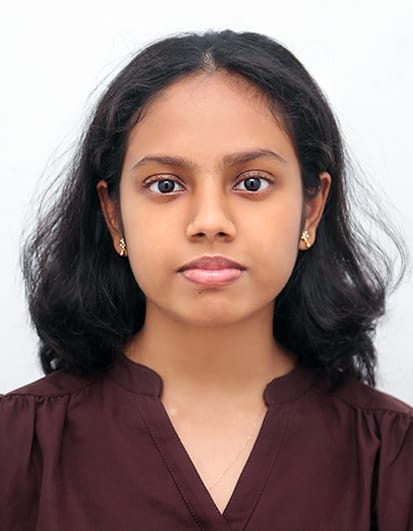

# About Us

We are a team based in the [School of Computing, National University of Singapore](http://www.comp.nus.edu.sg).

You can reach us at the email `seer[at]comp.nus.edu.sg`

## Project team

### Jain Ananya

[[github](http://github.com/ananyaj1515)]
[[portfolio](team/ananyaj1515)]

* Role: Developer
* Responsibilities: Git Tracker

### Pooja Raju

[[github](http://github.com/pr8190)]
[[portfolio](team/pr8190.md)]

- Role: Developer
- Responsibilities: Data

### Keng How Chin

[github](https://github.com/kenghow)

* Role: Developer
* Responsibilities: Product Scope, Tester

### Achar Pavithra

[[github](https://github.com/pavithra-achar)]

* Role: Developer
* Responsibilities: Code Quality Tester

### Hunter Raiyu Dinh

[[github](http://github.com/dinhcodes)]
[[portfolio](team/dinhcodes.md)]

* Role: Developer
* Responsibilities: Full stack + UI
