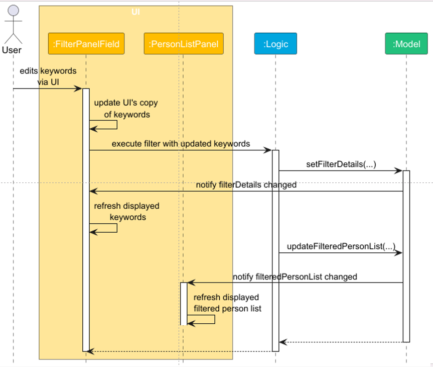

## **Hall Ledger Developer Guide**

<page-nav-print />

<!-- * Table of Contents -->

[//]: # (---)

[//]: # ()

[//]: # (<div class="section table-of-contents">)

[//]: # ()

[//]: # (### **Table of Contents**)

[//]: # ()

[//]: # (1. [Acknowledgements]&#40;#acknowledgements&#41;)

[//]: # (2. [Setting up, getting started]&#40;#setting-up-getting-started&#41;)

[//]: # (3. [Design]&#40;#design&#41;  )

[//]: # (   3.1. [Architecture]&#40;#architecture&#41;  )

[//]: # (   3.2. [UI component]&#40;#ui-component&#41;  )

[//]: # (   3.3. [Logic component]&#40;#logic-component&#41;  )

[//]: # (   3.4. [Model component]&#40;#model-component&#41;  )

[//]: # (   3.5. [Storage component]&#40;#storage-component&#41;  )

[//]: # (   3.6. [Common classes]&#40;#common-classes&#41;)

[//]: # (4. [Implementation]&#40;#implementation&#41;  )

[//]: # (   4.1. [How UI triggers command execution]&#40;#how-ui-triggers-command-execution&#41;  )

[//]: # (   4.3. [How the list command works]&#40;#how-the-list-command-works;  )

[//]: # (   4.2. [Demerit point tracking]&#40;#demerit-point-tracking&#41;  )

[//]: # (   4.2.1. [Rationale for the current design]&#40;#rationale-for-the-current-design&#41;  )

[//]: # (   4.2.2. [Current scope note]&#40;#current-scope-note&#41;  )

[//]: # (   4.3. [Demerit records UI]&#40;#demerit-records-ui&#41;)

[//]: # (5. [Documentation, logging, testing, configuration, dev-ops]&#40;#documentation-logging-testing-configuration-dev-ops&#41;)

[//]: # (6. [Appendix: Requirements]&#40;#appendix-requirements&#41;  )

[//]: # (   6.1. [Product scope]&#40;#product-scope&#41;  )

[//]: # (   6.2. [User stories]&#40;#user-stories&#41;  )

[//]: # (   6.3. [Use cases]&#40;#use-cases&#41;  )

[//]: # (   6.4. [Non-Functional Requirements]&#40;#non-functional-requirements&#41;  )

[//]: # (   6.5. [Glossary]&#40;#glossary&#41;)

[//]: # (7. [Appendix: Instructions for Manual Testing]&#40;#appendix-instructions-for-manual-testing&#41;  )

[//]: # (   7.1. [Launch and shutdown]&#40;#launch-and-shutdown&#41;  )

[//]: # (   7.2. [Adding a resident]&#40;#adding-a-resident&#41;  )

[//]: # (   7.3. [Finding residents]&#40;#finding-residents&#41;  )

[//]: # (   7.4. [Tagging a resident]&#40;#tagging-a-resident&#41;  )

[//]: # (   7.5. [Adding a remark]&#40;#adding-a-remark&#41;  )

[//]: # (   7.6. [Demerit features]&#40;#demerit-features&#41;  )

[//]: # (   7.7. [Deleting a resident]&#40;#deleting-a-resident&#41;)

[//]: # (8. [Appendix: Planned Enhancements]&#40;#appendix-planned-enhancements&#41;)

[//]: # ()

[//]: # (</div>)


--------------------------------------------------------------------------------------------------------------------

<div class = section>

## **Acknowledgements**

* Hall Ledger’s demerit rule catalogue is adapted from the NUS Office of Student Affairs **Demerit Point Structure (DPS)
  for Breach of Housing Agreement**, dated 9 January 2026.
* This project is based on the **AddressBook-Level3 (AB3)** codebase from [se-education/addressbook-level3](https://github.com/se-edu/addressbook-level3).
* The team has used Github co-pilot to assist with the code in this project, as well as to answer 
  questions on architectural, class designs, and menial tasks such as enhancing css styles, but the team has made 
  sure to understand and review all code written by co-pilot.
* The Remark feature has been adapted from the [tutorial](https://se-education.org/guides/tutorials/ab3AddRemark.html) provided by the teaching team

</div>

--------------------------------------------------------------------------------------------------------------------

<div class = section>

## **Setting up, getting started**

Refer to the guide [_Setting up and getting started_](SettingUp.md).

</div>

--------------------------------------------------------------------------------------------------------------------

<div class = section>

## **Design**

### Architecture

<puml src="diagrams/ArchitectureDiagram.puml" width="300" />

The ***Architecture Diagram*** given above explains the high-level design of the App.

Given below is a quick overview of main components and how they interact with each other.

**Main components of the architecture**

**`Main`** (consisting of classes [
`Main`](https://github.com/AY2526S2-CS2103T-T15-1/tp/tree/master/src/main/java/seedu/address/Main.java) and [
`MainApp`](https://github.com/se-edu/addressbook-level3/tree/master/src/main/java/seedu/address/MainApp.java)) is in
charge of the app launch and shut down.
* At app launch, it initializes the other components in the correct sequence, and connects them up with each other.
* At shut down, it shuts down the other components and invokes cleanup methods where necessary.

The bulk of the app's work is done by the following four components:

* [**`UI`**](#ui-component): The UI of the App.
* [**`Logic`**](#logic-component): The command executor.
* [**`Model`**](#model-component): Holds the data of the App in memory.
* [**`Storage`**](#storage-component): Reads data from, and writes data to, the hard disk.

[**`Commons`**](#common-classes) represents a collection of classes used by multiple other components.

**How the architecture components interact with each other**

The *Sequence Diagram* below shows how the components interact with each other for the scenario where the user issues an add command.

<box type="info">
<b>Note:</b> For simplicity, we are using shortened form <code>add n=...`</code> to represent the user input for the diagram below
</box>

<puml src="diagrams/ArchitectureSequenceDiagram.puml" width="600" />

Each of the four main components (also shown in the diagram above),

* defines its *API* in an `interface` with the same name as the Component.
* implements its functionality using a concrete `{Component Name}Manager` class (which follows the corresponding API `interface` mentioned in the previous point.

For example, the `Logic` component defines its API in the `Logic.java` interface and implements its functionality using the `LogicManager.java` class which follows the `Logic` interface. Other components interact with a given component through its interface rather than the concrete class (reason: to prevent outside component's being coupled to the implementation of a component), as illustrated in the (partial) class diagram below.

<puml src="diagrams/ComponentManagers.puml" width="350" />

The sections below give more details of each component.

---

### UI component

The **API** of this component is specified in [
`Ui.java`](https://github.com/AY2526S2-CS2103T-T15-1/tp/blob/master/src/main/java/seedu/address/ui/Ui.java)
The following is a (partial) class diagram of the `UI` component:

<puml src="diagrams/UiClassDiagram.puml" width="900" alt="Structure of the UI Component" />

The UI consists of a `MainWindow` that is made up of parts e.g.`CommandBox`, `ResultDisplay`, `TabSection`,
`ListSection` etc. All these, including the `MainWindow`, inherit from the abstract `UiPart` class which captures the
commonalities between classes that represent parts of the visible GUI.

The `UI` component uses the JavaFX UI framework. The layout of these UI parts are defined in matching `.fxml` files
that are in the `src/main/resources/view` folder. For example, the layout of the [
`MainWindow`](https://github.com/AY2526S2-CS2103T-T15-1/tp/blob/master/src/main/java/seedu/address/ui/MainWindow.java)
is specified in
[`MainWindow.fxml`](https://github.com/AY2526S2-CS2103T-T15-1/tp/blob/master/src/main/resources/view/MainWindow.fxml)

The `UI` component,

* executes user commands using the `Logic` component.
* listens for changes to `Model` data so that the UI can be updated with the modified data.
* keeps a reference to the `Logic` component, because the `UI` relies on the `Logic` to execute commands.
* depends on some classes in the `Model` component, as it displays `Person` objects residing in the `Model`.

---

### Logic component

**API** : [
`Logic.java`](https://github.com/AY2526S2-CS2103T-T15-1/tp/blob/master/src/main/java/seedu/address/logic/Logic.java)

Here's a (partial) class diagram of the `Logic` component:

<puml src="diagrams/LogicClassDiagram.puml" width="450" />

The simplified sequence diagram below illustrates the interactions within the `Logic` component, taking a delete
command as an example.

<puml src="diagrams/DeleteSequenceDiagram.puml" width="800" />

<box type="info">

**Note:** The lifeline for `DeleteCommandParser` should end at the destroy marker (X) but due to a limitation of PlantUML, the lifeline continues till the end of diagram.

</box>

How the `Logic` component works:

1. When `Logic` is called upon to execute a command, it is passed to an `AddressBookParser` object which in turn creates a parser that matches the command (e.g., `DeleteCommandParser`) and uses it to parse the command.
1. This results in a `Command` object (more precisely, an object of one of its subclasses e.g., `DeleteCommand`) which is executed by the `LogicManager`.
1. The command can communicate with the `Model` when it is executed (e.g. to delete a person).<br>
   Note that although this is shown as a single step in the diagram above (for simplicity), in the code it can take several interactions (between the command object and the `Model`) to achieve.
1. The result of the command execution is encapsulated as a `CommandResult` object which is returned back from `Logic`.

Here are the other classes in `Logic` (omitted from the class diagram above) that are used for parsing a user command:

<puml src="diagrams/ParserClasses.puml" width="600" />

How the parsing works:

* When called upon to parse a user command, the `AddressBookParser` class creates an `XYZCommandParser` (`XYZ` is a placeholder for the specific command name e.g., `AddCommandParser`) which uses the other classes shown above to parse the user command and create a `XYZCommand` object (e.g., `AddCommand`) which the `AddressBookParser` returns back as a `Command` object.
* All `XYZCommandParser` classes (e.g., `AddCommandParser`, `DeleteCommandParser`, ...) inherit from the `Parser` interface so that they can be treated similarly where possible e.g., during testing.

---

### Model component

**API** : [
`Model.java`](https://github.com/AY2526S2-CS2103T-T15-1/tp/blob/master/src/main/java/seedu/address/model/Model.java)

<puml src="diagrams/ModelClassDiagram.puml" width="700" />

The `Model` component:

* stores Hall Ledger’s resident data as `Person` objects,
* stores the currently displayed resident list as a filtered `ObservableList<Person>`,
* stores the currently selected `Person` for UI synchronization,
* stores a `UserPrefs` object representing user preferences,
* stores a `FilterDetails` object representing the most recent resident filter,
* and does not depend on the `UI`, `Logic`, or `Storage` components.

Hall Ledger’s core domain entity is `Person`, which represents a resident. In addition to basic contact information, a resident can also store:
* typed tags such as year, major, and gender,
* a resident-level remark,
* and demerit incidents used to compute the total demerit points.

This keeps Hall Ledger’s domain model centered around hall-resident administration rather than a generic contact list.

---

### Storage component

**API** : [
`Storage.java`](https://github.com/AY2526S2-CS2103T-T15-1/tp/blob/master/src/main/java/seedu/address/storage/Storage.java)

<puml src="diagrams/StorageClassDiagram.puml" width="550" />

The `Storage` component:

* saves resident data and user preference data in JSON format,
* reads them back into the corresponding in-memory objects,
* depends on some classes in the `Model` component because it persists model data,
* and is responsible for preserving Hall Ledger-specific resident information such as tags, remarks, and demerit incidents.

This allows Hall Ledger to persist hall-administration data without coupling persistence logic to the model or UI layers.

---

### Common classes

Classes used by multiple components are placed in the `seedu.address.commons` package.

</div>

--------------------------------------------------------------------------------------------------------------------

<div class = section>

## **Implementation**

This section describes some noteworthy details on how certain features are implemented.

### How UI triggers command execution

Hall Ledger uses callback-style dependency injection to keep low-level UI components decoupled from command execution
details.

`MainWindow` holds the reference to `Logic` and implements small executor interfaces that match what child UI
components need.

The diagram below shows this flow: `MainWindow` implements `CommandExecutor` and `FilterExecutor`, then injects
itself into child components through their constructors. As a result, child components can request execution through
interfaces without knowing about `Logic` internals. For example, `CommandBox` only knows it has a `CommandExecutor` to
call when the user submits a command, and 'FilterPanel' only knows it has a `FilterExecutor` to call when the user
updates filter criteria.

<puml src="diagrams/find/UiExecutor.puml" width="650" />

`MainWindow` wires dependencies and defines the execution logic, then passes them into child UI constructors as
callbacks:

```java
public class MainWindow extends UiPart<Stage>
        implements CommandExecutor, FilterExecutor {

    public MainWindow(Logic logic) {
        commandBox = new CommandBox(this); // MainWindow as an instance of CommandExecutor
        filterPanel = new FilterPanel(logic.getFilterDetails(), this); // MainWindow as an instance of FilterExecutor
    }
}
```

Each child component triggers behavior only through these interfaces, without depending on parser or
`LogicManager` implementation details:

```java
// In CommandBox
CommandResult result = commandExecutor.execute(commandText);

// In FilterPanel
CommandResult result = filterExecutor.executeFilter(updatedFilterDetails);
```

This separation keeps responsibilities clear: UI components handle user input, while command and filter execution
remain centralized behind injected callbacks.

---

### Deep dive: How editing keywords from the UI triggers a `FindCommand`

This section details the callback chain that propagates keyword edits from a low-level UI component to higher-level
components, ultimately reaching the `Logic` module and triggering a `FindCommand`.

This sequence diagram illustrates the flow when a user modifies keywords to find residents from the UI:

<puml src="diagrams/find/FindUiTriggerSequenceDiagram.puml" width="680" />

When a user modifies keywords in a `FilterPanelField`, the field notifies its parent `FilterPanel` via a callback.
`FilterPanel` then forwards the change to `MainWindow` through the `FilterExecutor` callback.

`MainWindow` passes the updated filter details to `Logic`, which creates and executes a `FindCommand` based on the new
filter criteria.

---

### How the UI stays synced with the Model

As described above, changes originating from low-level UI components propagate upward to `Logic` and `Model` via
callbacks. But what about updates flowing in the opposite direction, from the `Model` back to the `UI`?

Hall Ledger leverages JavaFX's `ObservableList`, `ListView`, and property bindings to automatically synchronize the
UI with changes in the Model. When the `Model` updates any of its observable values, registered UI observers are
notified and refresh their displays accordingly—without any passing of properties or callbacks.

[//]: # (Due to a PUML limitation, the activation bar for `PersonListPanel` extends beyond the point where the class 
calls a method upon itself. Therefore, we patch the issue using an image of the intended diagram instead of the actual 
PUML output.)



[//]: # (<puml src="diagrams/find/FindUiFilterDetailsSequenceDiagram.png" width="650" />)

---

### How Add feature works

The implementation of the `Add Command` follows the general command execution flow described [above](#logic-component).
As an example, the sequence diagram below illustrates the flow when a user inputs `add n=Alice Tan p=+65 91234567 e=alice.tan@gmail.com i=A1234567X r=15R ec=+65 91234567`:

<puml src="diagrams/AddSequenceDiagram.puml" width="850" />

<box type="info">
Note: We use `add n=Alice Tan ...` in the diagram for simplicity's sake
</box>

The main execution steps are:
1. User enters the command `add n=Alice Tan p=+65 91234567 e=alice.tan@gmail.com i=A1234567X r=15R ec=+65 91234567` to add a new resident.
2. `LogicManager` receives the input and calls `parseCommand` in the `AddressBookParser`.
3. `AddressBookParser` recognizes the command as `add` command and creates an `AddCommandParser` instance to parse the input.
4. `AddCommandParser` processes and validates the input, and on successful parsing, creates an `AddCommand` object with the details of the new `Person`.
5. The `AddCommand` instance is returned to `LogicManager`, which then calls its `execute` method.
6. `AddCommand` checks if the given `Person` causes duplicates in the `Model`. 
7. If not, it adds the new `Person` to the `Model`
8. Once the adding is completed, `AddCommand` returns a `CommandResult` indicating that the execution was successful.
9. The result is then returned to LogicManager.


---
### How the `list` command works

Implementation of `list` **differs** slightly from the general command format described in the Logic Implementation. As `list` does not take any arguments, it does not require its own `Parser` class to manage inputs.

<puml src="diagrams/ListSequenceDiagram.puml" width="650"/>

<br>

Main Execution Steps:

1. User enters the `list` command to view all residents
2. `LogicManager` receives the input and calls `parseCommand("list")` on `AddressBookParser`
3. `AddressBookParser` recognises the command as a `list` command and creates a `ListCommand` instance directly as no arguments need to be parsed
4. The created `ListCommand` is returned to the `LogicManager`
5. `LogicManager` invokes `execute(model)` on `ListCommand` to perform the listing
6. `ListCommand` calls `model.showAllPersons` to update the displayed list of residents
7. After updating the list, `ListCommand` creates and returns a `CommandResult` indicating that the execution was successful
8. The result is then returned to `LogicManager`


### Demerit point tracking

Hall Ledger stores demerit incidents as resident-level records instead of storing only a mutable running total.

Each demerit incident records:
* the DPS rule index,
* the rule title,
* the offence number for that resident and rule,
* the points applied for that occurrence,
* and an optional remark.

The resident’s total demerit points are **derived** by summing the points applied across all stored demerit incidents. This avoids duplicated derived state and keeps the resident’s demerit history auditable.

The demerit feature is split into two user-facing commands:

* `demeritlist` — displays the indexed demerit rule catalogue and point tiers.
* `demerit` — applies an indexed demerit rule to a resident identified by Student ID.

#### Rationale for the current design

A resident may commit the same rule multiple times, and the DPS applies different point tiers based on repeated occurrences. Hence, storing only a running total would lose important context such as:
* which rule was applied,
* how many times it has already been committed by that resident,
* and what exact points were awarded for that occurrence.

By storing incidents individually, Hall Ledger can:
* reconstruct total demerit points at any time,
* preserve a readable incident history,
* and support future enhancements such as warnings, alerts, or administrative review.

#### Current scope note

Hall Ledger currently records resident demerit incidents and computes accumulated totals. It does **not** yet 
automatically enforce semester-based or lifetime housing sanctions tied to DPS thresholds.

---

### Demerit records UI

Hall Ledger provides a dedicated **Demerit Records** tab for the currently selected resident.

This tab displays:
* the resident’s accumulated total demerit points,
* the resident’s demerit incident history,
* the rule description,
* incident remarks,
* and the points applied for each incident.

The tab updates when the selected resident changes.

This design was chosen because:

* Residential assistants often need both the current total and the incident history,
* showing only a running total would hide important context,
* and separating demerit records into a dedicated tab keeps the interface organized.

</div>

---

### How data is stored

Hall Ledger uses `JSON` files to store resident data using the `Jackson` library.

Hall Ledger stores all data in a single object type `Person`. Two more types `Tag` and `DemeritIncidents` are contained within this object. The structure of the JSON file is given below:
```
{
    "persons": [...]
}
```

Within the `Person` object, data is stored in the following format:
```
{
    "name" : "Charlotte Oliveiro",
    "phone" : "+65 93210283",
    "email" : "charlotte@example.com",
    "studentId" : "A1246354T",
    "roomNumber" : "3D",
    "emergencyContact" : "+65 87654321",
    "remark" : "Really funny person",
    "tags" : [...],
    "demeritIncidents" : [ ... ]
}
```

<box type="info">   
Hall Ledger does not allow duplicates to be stored. Duplicates are defined as residents with either the same `Student ID` or `Room Number`.
</box>

<br/>

Within the `Tag` object, data is stored in the following format:
```
{
  "tagType" : "GENDER",
  "tagContent" : "they/them"
}, {
  "tagType" : "YEAR",
  "tagContent" : "4"
}, {
  "tagType" : "MAJOR",
  "tagContent" : "Psychology"
}
```

* Hall Ledger supports three types of tags: `GENDER`, `YEAR`, and `MAJOR`.


<br/>

Within the `DemeritIncidents` object, data is stored in the following format:
```
{
  "ruleIndex" : 18,
  "ruleTitle" : "Visit by non-residents of the hostel or visiting a resident of another hostel during quiet hours",
  "offenceNumber" : 1,
  "pointsApplied" : 6,
  "remark" : "Quiet-hours visitor warning"
}
```

* The `pointsApplied` field depends on the `ruleIndex` and increases with increase in `offenseNumber`. See the [Demerit Implementation] for more details.

--------------------------------------------------------------------------------------------------------------------

<div class = section>

## **Documentation, logging, testing, configuration, dev-ops**

* [Documentation guide](Documentation.md)
* [Testing guide](Testing.md)
* [Logging guide](Logging.md)
* [Configuration guide](Configuration.md)
* [DevOps guide](DevOps.md)

</div>

--------------------------------------------------------------------------------------------------------------------

<div class = section>

## **Appendix: Requirements**

### Product scope

Hall Ledger is a desktop application for **Resident Assistants (RAs)** and other hall administrators who need to 
manage resident records in NUS halls efficiently.

Beyond basic resident record management, Hall Ledger supports common hall-administration workflows such as:
* organizing residents by typed tags,
* recording short operational remarks,
* and tracking demerit incidents in a structured way.

Hall Ledger is **not** intended to replace university-wide housing allocation systems, payment systems, or 
institutional access-control systems.

**Target user profile**

The target user:
* manages many residents,
* frequently needs quick access to resident information,
* prefers keyboard-driven workflows where possible,
* and wants a local desktop tool rather than scattered spreadsheets or notes.

**Value proposition**

Hall Ledger helps residential assistants (RAs) manage resident records faster and with fewer errors than spreadsheets 
or ad hoc note-taking workflows, while keeping hall-specific information such as tags, remarks, and demerit incidents in one place.

--- 

### User stories

Priorities: High (must have) - `* * *`, Medium (nice to have) - `* *`, Low (unlikely to have) - `*`

| Priority | As a(n)…        | I want to…                                   | So that I can…                                              |
|----------|-----------------|----------------------------------------------|-------------------------------------------------------------|
| `* * *`  | forgetful user  | see usage instructions                       | refer to them when I forget how to use the app              |
| `* * *`  | RA              | add new residents                            | start tracking and supporting students under my care quickly|
| `* * *`  | RA              | view all residents at once                   | get a clear overview of all residents assigned to me        |
| `* * *`  | RA              | search for existing residents                | quickly find a specific resident’s information when needed  |
| `* * *`  | RA              | delete residents                             | remove residents who no longer stay in hall                 |
| `* * *`  | RA              | clear all residents                          | reset the system efficiently for a new semester             |
| `* * *`  | RA              | edit existing residents' information         | correct or update resident details when they change         |
| `* * *`  | RA              | administer demerit points to residents       | accurately track and record behavioural incidents           |
| `* * *`  | RA              | filter residents                             | easily view residents based on relevant criteria            |
| `* * *`  | RA              | add custom tags to residents                 | organise residents based on categories that matter to me    |
| `* * *`  | RA              | add notes to residents                       | record important context or conversations for future reference |
| `* *`    | RA              | administer CCA points to residents           | track resident involvement in hall activities               |
| `* *`    | RA              | view residents' CCA records                  | review residents' involvement when making retention decisions |
| `* `     | RA              | rank residents by accumulated CCA points     | compare residents more easily during evaluations            |
| `* *`    | RA              | view resident demerit records                | understand a resident’s behavioural history at a glance     |
| `* `     | RA              | generate occupancy reports by floor and room | plan housing allocation more effectively for the next semester |
| `* `     | RA              | export all data to a downloadable file       | share or analyse resident data externally                   |

--- 

### Use cases

For all use cases below, the **System** is Hall Ledger and the **Actor** is the Residential Assistant (RA), unless specified otherwise.

#### UC01 — Add a New Resident

**Main Success Scenario (MSS):**

1. RA requests to add a new resident by providing the resident's details.
2. Hall Ledger adds the new resident.
3. Hall Ledger signals success and displays the newly added resident.

Use case ends.

**Extensions:**

- **1a.** Hall Ledger detects an error in the entered data.
    - 1a1. Hall Ledger informs the RA of the error and reminds RA of the correct format.
    - Use case resumes from step 1.
- **1b.** Hall Ledger detects a resident with the same identification already exists.
    - 1b1. Hall Ledger informs the RA and cancels the addition.
    - Use case resumes from step 1.

#### UC02 — View a Resident's Details

**Main Success Scenario (MSS):**

1. RA requests to list all residents.
2. Hall Ledger shows a list of residents.
3. RA identifies a specific resident from the list.
4. Hall Ledger displays the specified resident's details.

Use case ends.

**Extensions:**

- **1a.** The resident list is empty.
    - 1a1. Hall Ledger indicates that the resident list is empty.
    - Use case ends.
- **3a.** Hall Ledger cannot find the specified resident.
    - 3a1. Hall Ledger informs the RA that the resident cannot be found and cancels the view.
    - Use case ends.

#### UC03 — Edit a Resident's Info

**Main Success Scenario (MSS):**

1. RA requests to edit a resident by providing the details to be edited.
2. Hall Ledger updates the resident's details.
3. Hall Ledger signals success and shows the edited resident.

Use case ends.

**Extensions:**

- **1a.** Hall Ledger cannot find the resident.
    - 1a1. Hall Ledger informs the RA that the resident cannot be found and cancels the edit.
    - Use case resumes from step 1.
- **1b.** Hall Ledger detects an error in the entered data.
    - 1b1. Hall Ledger informs the RA of the error and cancels the edit.
    - Use case resumes from step 1.

#### UC04 — Delete a Resident

**Main Success Scenario (MSS):**

1. RA requests to delete a resident.
2. Hall Ledger asks for confirmation.
3. RA confirms the deletion.
4. Hall Ledger deletes the resident.
5. Hall Ledger signals success and shows the updated resident list.

Use case ends.

**Extensions:**

- **1a.** Hall Ledger cannot find the resident.
    - 1a1. Hall Ledger informs the RA that the resident cannot be found and cancels the deletion.
    - Use case ends.
- **1b.** Hall Ledger detects an error in the entered data.
    - 1b1. Hall Ledger informs the RA of the error and cancels the deletion.
    - Use case resumes from step 1.
- **2a.** RA cancels the deletion.
    - 2a1. Hall Ledger cancels the deletion.
    - Use case ends.

#### UC05 — Find Residents

**Main Success Scenario (MSS):**

1. RA requests to find residents by name or another specific attribute.
2. Hall Ledger finds residents matching the criteria.
3. Hall Ledger shows a list of matching residents.

Use case ends.

**Extensions:**

- **1a.** RA provides empty keywords or an invalid command format.
    - 1a1. Hall Ledger shows an error message indicating correct usage.
    - Use case ends.
- **1b.** RA provides invalid keywords for attributes with fixed values (e.g. year, gender).
    - 1b1. Hall Ledger displays a warning that invalid keywords will be ignored.
    - Use case ends.
- **2a.** No residents match the given criteria.
    - 2a1. Hall Ledger shows an empty result and indicates that no residents were found.
    - Use case ends.

#### UC06 — Add a Demerit Record

**Main Success Scenario (MSS):**

1. RA requests to list the available demerit rules.
2. Hall Ledger displays the demerit rule list.
3. RA requests to add a demerit rule breach for a specific resident.
4. Hall Ledger records the demerit breach for the resident.
5. Hall Ledger updates the resident's total demerit points.
6. Hall Ledger signals success and displays the updated demerit points and breaches.

Use case ends.

**Extensions:**

- **3a.** Hall Ledger cannot find the specified resident.
    - 3a1. Hall Ledger informs the RA that the resident cannot be found and cancels the demerit addition.
    - Use case resumes from step 3.
- **3b.** The given demerit breach does not exist in the demerit rules.
    - 3b1. Hall Ledger informs the RA that the breach cannot be found and cancels the demerit addition.
    - Use case resumes from step 2.

#### UC07 — Add a Tag to a Resident

**Main Success Scenario (MSS):**

1. RA requests to tag a resident by providing tag value(s).
2. Hall Ledger updates the tag(s) for the resident.
3. Hall Ledger signals success and shows the updated resident record.

Use case ends.

**Extensions:**

- **1a.** Hall Ledger cannot find the specified resident.
    - 1a1. Hall Ledger informs the RA that the resident cannot be found and cancels the tagging.
    - Use case resumes from step 1.
- **1b.** Hall Ledger detects an error in the entered tag value(s).
    - 1b1. Hall Ledger informs the RA of the error and cancels the tagging.
    - Use case resumes from step 1.

---

### Non-Functional Requirements

1. Should work on any mainstream OS as long as it has Java 17 or above installed.

2. Should be able to store up to 250 students without noticeable sluggishness in performance for typical usage.

3. Should have a response time of < 3 seconds for all instructions.

4. A user with above-average typing speed for regular English text (i.e., not code, not system admin commands) should be able to accomplish most tasks faster using commands than using the mouse.

5. Interaction with the product should be intuitive even for non-technical users, e.g., simple error messages should be displayed and help should be easily available when needed.

6. The product is not required to handle more than one user at a time.

7. The product should be free to use and open source.

8. The product should not need an internet connection to use.

---

### Glossary

* **Resident**: A hall resident stored in Hall Ledger.
* **RA**: Resident Assistant.
* **Student ID**: The identifier used by Hall Ledger to target a resident.
* **Remark**: A short resident-level operational note.
* **Demerit incident**: A single recorded rule breach applied to a resident.
* **Demerit rule**: A rule in the demerit catalogue that can be applied using `demerit`.
* **DPS**: Demerit Point Structure used as the source reference for Hall Ledger’s demerit rules.
* **Prefix**: A keyword followed by an equals sign (`=`) used to specify a field in a command. For example, `n=` is the prefix for the name field, and `i=` is the prefix for the Student ID field.
* **Field**: A piece of information about a resident, such as name, phone number, email, room number, tags, remark, or demerit incidents.
* **Keyword**: A string used to search for residents in the `find` command. For example, `John` is a keyword that can be used to find residents whose names contain "John".

</div>

---

<div class = section>

## Appendix: Instructions for Manual Testing

Given below are instructions to test the app manually.

<box type="info">

These instructions provide a starting point. Testers are expected to do exploratory testing beyond them.

</box>

### Launch and shutdown

1. Initial launch
   1. Download the jar file into an empty folder.
   2. Run the app.
      Expected: Hall Ledger starts with sample data.

2. Closing and reopening
   1. Close the app.
   2. Launch it again.
      Expected: previously saved data and preferences are restored.

---

### Adding a resident

1. Valid add
   1. Enter
      `add n=John Doe p=+6598765432 e=johnd@example.com i=A1234567X r=15R ec=+65 91234567`
   2. Verify that the resident is added and the result box shows success.

2. Invalid add
   1. Enter an add command with an invalid field value.
   2. Verify that Hall Ledger rejects the command.

---

### Finding residents

This section provides instructions on how to do simple testing with the find command with the sample hall ledger data.

1. Delete the data file. This is likely located in ./data/hall-ledger.json relative to the folder in which you place the
   hall-ledger.jar file.
2. Launch the app to load the sample data.
3. Find by name (exact match)
    1. Enter
       `find n=alex yeoh`
    2. Expected: "Alex Yeoh" is shown.
4. Find by name (fuzzy match - substring)
    1. Enter
       `find n=o`
    2. Expected: "Alex Yeoh", "Charlotte Oliveiro", and "Roy Balakrishnan" are shown.
5. Find by name (fuzzy match - typo tolerance)
    1. Enter
       `find n=alex yerz`
    2. Expected: "Alex Yeoh" is shown.
6. Find by multiple fields and multiple prefixes
    1. Enter
       `find m=Computer Science m=Business y=2 y=3`
    2. Expected: "Alex Yeoh" is shown.

---

### Tagging a resident

1. Enter
   `tag i=A1234567X y=2 m=Computer Science g=he/him`
2. Verify that the target resident’s tags are updated.

---

### Adding a remark

1. Enter
   `remark i=A1234567X rm=Peanut allergy`
2. Verify that the resident remark is updated.

---

### Demerit features

1. Show demerit rules
   1. Enter `demeritlist`
   2. Verify that Hall Ledger shows the supported rule list.

2. Add a demerit incident
   1. Enter
      `demerit i=A1234567X di=18 rm=Visitor during quiet hours`
   2. Verify that:
      * the command succeeds,
      * the success message includes the remark,
      * the resident’s demerit tab updates,
      * and the total demerit points increase correctly.

3. Repeated offence
   1. Enter the same `demerit` command again.
   2. Verify that the offence number and points reflect a repeated offence for that rule.

4. Invalid rule
   1. Enter
      `demerit i=A1234567X di=999`
   2. Verify that Hall Ledger rejects the command.

---

### Deleting a resident

1. Enter
   `delete i=A1234567X`
2. Verify that a confirmation dialog appears.
3. Cancel the deletion.
   Expected: the resident remains.
4. Repeat and confirm the deletion.
   Expected: the resident is removed.

</div>

--------------------------------------------------------------------------------------------------------------------

<div class = section>

## Appendix: Planned Enhancements

Team size: 5

1. Enable command to be executed by filtered list index instead of Student ID: Hall Ledger currently requires targeting residents by Student ID. We plan to also support targeting by the index shown in the currently displayed resident list, which may be more convenient for some users.

2. Improve robustness when users manually edit `hall-ledger.json`: Hall Ledger currently expects manually edited JSON
   data to
   remain logically valid. We plan to detect and explain more invalid manual edits instead of only failing at load time.

3. Currently, in order to toggle and/or view certain UI components without a mouse (dashboard, details,
   profile, demerit records, filter panel), users can only do so through arrow keys or pressing Tab with a lot of
   maneuver. We plan to add specific CLI commands to toggle and/or view these components, which may improve
   efficiency for typing-preferred users.

4. Make tag-validation error messages more specific: Hall Ledger currently rejects invalid tag inputs, but some error messages can still be made more precise. We plan to state more clearly which tag field failed validation and why.

5. Improve delete-confirmation feedback: Hall Ledger currently confirms deletion using a modal dialog. We plan to make the feedback around cancellation and confirmation even clearer so users can more easily distinguish between aborted and completed deletion flows.

6. Make repeated-demerit feedback more informative: Hall Ledger currently shows the applied rule, remark, points added, and updated total. We plan to also surface the offence number more prominently in the success feedback for easier verification.

7. Improve messaging for invalid resident targeting: Commands such as `edit`, `remark`, and `demerit` reject 
   nonexistent Student IDs. We plan to standardize those error messages further so the reason for failure is even 
   clearer to users.

8. Improve save-failure guidance for write-protected folders: Hall Ledger currently depends on write access to its home folder. We plan to provide clearer user-facing guidance when saving fails due to file-permission issues.

9. Improve documentation alignment for platform-specific behavior: Hall Ledger currently documents known issues such as dialog behavior and write-protected folders. We plan to keep refining the UG/DG wording and screenshots so platform-specific caveats remain easy to understand.

10. Long names and emails may seem cut off in the resident list section and profile details. To make the residents'
    details
    selectable, we had to use `TextField` rather than `Label` to represent the residents' details. However, JavaFx
    does not allow text-wrapping or elipsis-creation for `TextField`, so users may have the impression that these
    personal fields are cut off, when they are actually fully visible if one were to select the text and scroll
    horizontally. In the future, we might consider implementing a custom text component that allows text selection and
    horizontal scrolling while also showing an ellipsis when the text exceeds the available width.

</div>

