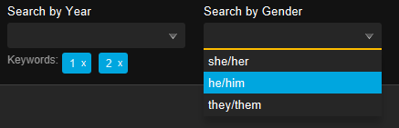
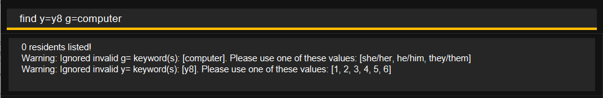

# More Details on Matching

This page explains how Hall Ledger decides whether a resident matches your `find` input.

## 1. Types of matching

### Exact matching

Exact matching is the simplest form of matching: your keyword must be **identical** to the target value
(case-insensitive).

**Example:**

| You type | Target value | Exact Match? |
|----------|--------------|--------------|
| `alex`   | `alex`       | Yes          |
| `ALEX`   | `alex`       | Yes          |

### Fuzzy matching
Hall Ledger uses **fuzzy matching** to make searches more forgiving.
Your keyword is treated as a match to the target value when any of the following is true (all comparisons ignore
uppercase/lowercase):

1. **Exact match** — your keyword is the same as the target.
2. **Substring match** — your keyword appears inside the target.
3. **Typo tolerance** — your keyword is 4 or more characters long, and differs from the target by at most
   2 edits (via character insertions, deletions, or substitutions).

<box type="info" seamless>

The reason why Hall Ledger disables typo tolerance for keywords shorter than 4 characters is to prevent too many
false positives. For example, if you use the keyword `Ann`, if typo tolerance is enabled, it would allow it match
target values such as `Jon`, `AJ` or `Ben`, which would make the find function less useful.

</box>

**Examples:**

| You type | Target value | Fuzzy Match? | Why                                                |
|----------|--------------|--------------|----------------------------------------------------|
| `alex`   | `alex`       | Yes          | Exact match                                        |
| `ALEX`   | `alex`       | Yes          | Exact match                                        |
| `a`      | `alex`       | Yes          | `a` is a substring of `alex`                       |
| `alez`   | `alex`       | Yes          | Only 1 edit apart (substitute `z` with `x`)        |
| `ann`    | `ana`        | No           | Your keyword `ana` is too short for typo tolerance |

------

## 2. Which fields use which matching style?

| Prefix | Field             | Matching style       | Example                                                                                |
|--------|-------------------|----------------------|----------------------------------------------------------------------------------------|
| `n=`   | Name              | Fuzzy                | `n=alex` can match `Alex Tan`.                                                         |
| `p=`   | Phone             | Fuzzy                | `p=9123` can match `+65 91234567`.                                                     |
| `e=`   | Email             | Fuzzy                | `e=@gmail` can match `alex@gmail.com`.                                                 |
| `i=`   | Student ID        | Exact*               | `i=a1234567x` matches `A1234567X`; `i=1234` does **not** match `A1234567X`.            |
| `ec=`  | Emergency contact | Fuzzy                | `ec=9876` can match `+65 98765432`.                                                    |
| `r=`   | Room number       | Fuzzy                | `r=12` can match `12A`.                                                                |
| `y=`   | Year tag          | Exact (normalised)** | `y=1` matches a resident tagged with year `1`.                                         |
| `m=`   | Major tag         | Fuzzy                | `m=computer sci` can match `Computer Science`.                                         |
| `g=`   | Gender tag        | Exact (normalised)** | `g=he` matches `he/him`; `g=her` matches `she/her`; `g=they/them` matches `they/them`. |

------

## 3. Notes on exact-match fields

- **Student ID** uses exact matching because it is a unique identifier.
Partial or fuzzy matches would produce too many false positives, since many student IDs share similar digit sequences.

<box type="tip" seamless>

**Tip:** Because each Student ID is unique, searching with the full ID (e.g. `find i=A1234567X`) is guaranteed to return
exactly one resident. This is a quick way to pull up a specific resident's profile.

</box>

- **Year** and **Gender** only accepts a fixed set of valid values. Therefore, these fields are also exact-match,
  but with an extra normalisation step to convert user input into the standardised form.
See [Section 4](#4-note-on-year-and-gender-keywords) for details.

------

## 4. Note on Year and Gender

Hall Ledger only accepts a fixed set of values for Year and Gender tags:

- **Valid year values:** `1`, `2`, `3`, `4`, `5`, `6`
- **Valid gender values:** `he/him`, `she/her`, `they/them`

This is meant to be useful for users, as it allows for consistent data entry. This is also why the Filter Panel
uses selection boxes instead of text inputs for these two fields.

 

**How normalisation works:**

When you use `find` on the command line, Hall Ledger normalises your input before matching:

- **Year** — must be exactly `1`, `2`, `3`, `4`, `5` or `6`. Any other value (e.g. `Y1`, `7`, `01`) is invalid.
- **Gender** — shorthand forms such as `he`, `him`, `she`, `her`, `they`, or `them` are automatically expanded to
  their full pronoun form (`he/him`, `she/her`, `they/them`). Any other value (e.g. `male`, `female`) is invalid.

If you enter an invalid year or gender keyword, Hall Ledger will not throw an error. Instead, it will simply
**ignore invalid keywords** and show a warning — the rest of your search still runs normally.

-----

## 5. How multiple filters combine

<box type="info" seamless>

- **Different prefixes** narrow the results — a resident must match **all** specified fields.
    - `find n=Alice y=1` → name matches `Alice` **and** year matches `1`.
    - `find ec=98765432 m=CS` → emergency contact matches `98765432` **and** major matches `CS`.

 

- **Repeating the same prefix** widens that filter — a resident only needs to match **any one** of those keywords.
    - `find y=2 y=3` → year is `2` **or** `3`.
    - `find n=Alice n=Bob` → name matches `Alice` **or** `Bob`.
    - `find n=Alice n=Bob y=2 y=3` → (name matches `Alice` **or** `Bob`) **and** (year is `2` **or** `3`).

</box>
