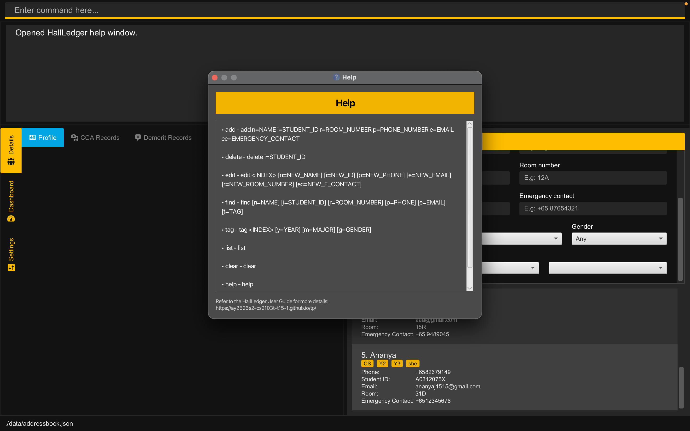

 ---
  layout: default.md
  title: "User Guide"
  pageNav: 3
 ---

# Hall Ledger User Guide

Hall Ledger (HL) is a **desktop app for managing residents in an NUS hostel, optimized for use via a Command Line Interface** (CLI) while still having the benefits of a Graphical User Interface (GUI). If you can type fast, HL can get your administration management tasks done faster than traditional GUI apps.

<!-- * Table of Contents -->
<page-nav-print />

--------------------------------------------------------------------------------------------------------------------

## Quick start

1. Ensure you have Java `17` or above installed in your Computer. 
   **Mac users:** Ensure you have the precise JDK version prescribed [here](https://se-education.org/guides/tutorials/javaInstallationMac.html).

1. Download the latest `.jar` file from [here](https://github.com/AY2526S2-CS2103T-T15-1/tp/releases).

1. Copy the file to the folder you want to use as the _home folder_ for your HallLedger.

1. Open a command terminal, `cd` into the folder you put the jar file in, and use the `java -jar hall-ledger.jar` command to run the application. 
   A GUI similar to the below should appear in a few seconds. Note how the app contains some sample data. 
   

1. Type the command in the command box and press Enter to execute it. e.g. typing **`help`** and pressing Enter will open the help window. 
   Some example commands you can try:

   * `list` : Lists all contacts.

   * `add n=John Doe p=+6598765432 e=johnd@example.com i=A1234567X r=1A ec=+65 12345678` : Adds a contact named `John Doe` to the Hall Ledger.

   * `delete i=A1234567X` : Deletes the resident with student id A1234567X.

   * `clear` : Deletes all contacts.

   * `exit` : Exits the app.

1. Refer to the [Features](#features) below for details of each command.

--------------------------------------------------------------------------------------------------------------------

## Features

<box type="info" seamless>

**Notes about the command format:** 

* Words in `UPPER_CASE` are the parameters to be supplied by the user. 
  e.g. in `add n=NAME`, `NAME` is a parameter which can be used as `add n=John Doe`.

* Items in square brackets are optional. 
  e.g `n=NAME [e=EMAIL]` can be used as `n=John Doe e=johnd@example.com` or as `n=John Doe`.

* Items with `…`​ after them can be used multiple times including zero times. 
  e.g. `[t=TAG]…​` can be used as ` ` (i.e. 0 times), `t=friend`, `t=friend t=family` etc.

* Parameters can be in any order. 
  e.g. if the command specifies `n=NAME p=PHONE_NUMBER`, `p=PHONE_NUMBER n=NAME` is also acceptable.

* Extraneous parameters for commands that do not take in parameters (such as `help`, `list`, `exit` and `clear`) will be ignored. 
  e.g. if the command specifies `help 123`, it will be interpreted as `help`.

* If you are using a PDF version of this document, be careful when copying and pasting commands that span multiple lines as space characters surrounding line-breaks may be omitted when copied over to the application.

</box>

### Viewing help : `help`

Opens the HallLedger Help window, which displays the available commands and their usage formats.

Format: `help`

Example:
* `help`

When the command is entered, HallLedger opens a Help window containing a quick reference list of supported commands. The Help window also includes a reference to the HallLedger User Guide for more detailed explanations.

### Adding a person: `add`

Adds a person to the hall ledger.

Format: `add n=NAME p=PHONE_NUMBER e=EMAIL i=STUDENT_ID r=ROOM_NUMBER ec=EMERGENCY_CONTACT`

Examples:
* `add n=John Doe p=+6598765432 e=johnd@example.com i=A101010X r=1A ec=+91 2345 9876`
* `add n=Betsy Crowe i=A202020Y e=betsycrowe@example.com p=+65 1234567 r=14L ec=+6512345678`

### Listing all persons : `list`

Shows a list of all persons in the address book.

Format: `list`

### Tagging a student: `tag`

Adds **Major**, **Year** and **Gender** tags to an existing student.

Format: `tag i=STUDENT_ID [m=MAJOR] [y=YEAR] [g=GENDER]`

* Adds or edits tags for the student uniquely identified by *STUDENT_ID*.
* *STUDENT_ID* must in valid format and exist in the Hall Ledger
* At least one of the optional tag fields (m=, y=, g=) must be provided.
* Existing tags are replaced **(not cumulative)**.
* Each student can have **at most** **one** Year, **one** Major, and **one** Gender tag at any time.
* Re-tagging a student will **overwrite** previously assigned tags with the new values provided.

Examples:
* `tag i=A0123456N y=Y3 m=Information Systems`: Assigns Year 3 and Information Systems as the student’s tags (any existing tags are replaced).
* `tag i=A0101010X g=Female`: Updates the student’s Gender to Female and leaves other tags unchanged.

### Editing a person : `edit`

Edits an existing student in the _Hall Ledger_.y

Format: `edit STUDENT_ID [n=NAME] [p=PHONE] [e=EMAIL] [r=ROOM_NUMBER] [ec=EMERGENCY_CONTACT]​`

* Edits the student with the specified STUDENT_ID. STUDENT_ID is used to uniquely identify each student in the displayed student's list. The STUDENT_ID must be a valid student ID e.g. `A1234567X`.
* At least one of the optional fields must be provided.
* Existing values will be updated to the input values.

Examples:
*  `edit A1234567X p=91234567 e=johndoe@example.com` Edits the phone number and email address of the resident with student ID `A1234567X` to be `91234567` and `johndoe@example.com` respectively.
*  `edit A8765432Y n=Betsy Crower ec=98765432` Edits the name and emergency contact of the resident with student ID `A8765432Y` to be `Betsy Crower` and `98765432` respectively.

### Locating persons: `find`

Finds persons using one of two methods:
1. [Find by name](#method-1-find-by-name)
2. [Find by attributes](#method-2-find-by-attributes)

#### Method 1: Find by name

Finds persons whose names contain any of the given keywords.

Format: `find NAME_KEYWORD [MORE_NAME_KEYWORDS]`

* Case-insensitive: `find Hans Bo` gives the same result as `find hans bo`.
* Keyword order does not matter.
* Multiple keywords are OR-based for names.
  * e.g. `find Hans Bo Anna` can return residents such as `Hans Gruber`, `Bo Yang`, `Anna Lee`.
* Name matching supports exact, substring, and typo-tolerant matching for longer words.
  * e.g. `find Alex` can match `Alex`, `Alexander`, and close typos such as `Alxe`.

Examples:
* `find John` returns `john` and `John Doe`
* `find alex david` returns `Alex Yeoh`, `David Li` 

#### Method 2: Find by attributes

Finds persons who match multiple attributes such as name, phone number, email or major.

Format: `find [n=NAME] [p=PHONE] [e=EMAIL] [r=ROOM_NUMBER] [i=STUDENT_ID] [ec=EMERGENCY_CONTACT] [y=YEAR] [m=MAJOR] [g=GENDER]`

* Case-insensitive and order-independent across prefixes.
  * e.g. `find n=Alice y=Y1` gives the same result as `find y=Y1 n=ALICE`.
* Different prefixes are combined by AND logic.
  * e.g. `find n=Alice p=9123 y=Y1` returns residents that satisfy all three filters.
* Repeating the same prefix is OR-based.
  * e.g. `find y=Y2 y=Y3` returns Year 2 or Year 3 residents.
  * e.g. `find n=Hans Bo n=Anna` can return residents matching either name group.
* Matching behavior by field:

| Prefix | Field | Match type | Notes |
| --- | --- | --- | --- |
| `n=` | Name | Fuzzy | Same behavior as Method 1 (exact, contains, typo-tolerant for longer words). |
| `p=` | Phone | Fuzzy (contains) | Case-insensitive partial match. |
| `e=` | Email | Fuzzy (contains) | Case-insensitive partial match. |
| `i=` | Student ID | Fuzzy (contains) | Case-insensitive partial match. |
| `ec=` | Emergency contact | Fuzzy (contains) | Case-insensitive partial match. |
| `r=` | Room number | Exact | Case-insensitive exact match only. |
| `y=` | Year tag | Exact | Case-insensitive exact tag match. |
| `g=` | Gender tag | Exact | Case-insensitive exact tag match. |
| `m=` | Major tag | Fuzzy (contains) | Case-insensitive partial tag match. |

Examples:
* `find m=CS m=Economics g=Male g=Others` returns persons majoring in CS or Economics, and whose gender is listed as 
  Male or Others.
* `find ec=+84 e=gmail` returns persons whose emergency contact contains `+84` and whose email contains `gmail`.

Read more about fuzzy matching here: [Fuzzy Matching Details](FuzzyMatching.md).

### Deleting a resident : `delete`

Deletes the resident identified by student ID from HallLedger.

Format: `delete i=STUDENT_ID`

Example:
* `delete i=A0312075X`

After a valid delete command is entered, HallLedger shows a confirmation dialog before the resident is actually removed.

* Click **Confirm** to proceed with the deletion.
* Click **Cancel** to stop the deletion. HallLedger will display the message `Deletion cancelled.` and no resident will be removed.

If the command format is invalid, HallLedger will show an error message instead of opening the confirmation dialog.

### Clearing all entries : `clear`

Clears all entries from the address book.

Format: `clear`

### Exiting the program : `exit`

Exits the program.

Format: `exit`

### Saving the data

HallLedger data are saved in the hard disk automatically after any command that changes the data. There is no need to save manually.

### Editing the data file

HallLedger data are saved automatically as a JSON file `[JAR file location]/data/addressbook.json`. Advanced users are welcome to update data directly by editing that data file.

<box type="warning" seamless>

**Caution:**
If your changes to the data file makes its format invalid, HallLedger will discard all data and start with an empty data file at the next run.  Hence, it is recommended to take a backup of the file before editing it. 
Furthermore, certain edits can cause the HallLedger to behave in unexpected ways (e.g., if a value entered is outside the acceptable range). Therefore, edit the data file only if you are confident that you can update it correctly.

</box>

### Archiving data files `[coming in v2.0]`

_Details coming soon ..._

--------------------------------------------------------------------------------------------------------------------

## FAQ

**Q**: How do I transfer my data to another Computer?
**A** : Install the app in the other computer and overwrite the empty data file it creates with the file that contains the data of your previous AddressBook home folder.

**Q**: Can I edit the data file manually? 
**A**: Yes. HallLedger stores data locally in a human-editable text file. However, manual edits should be done carefully, because invalid edits may prevent HallLedger from loading the data correctly.

**Q**: How do I go back to seeing the list of all students after running `find`? 
**A**: Run the `list` command to see the full list of students again.

--------------------------------------------------------------------------------------------------------------------

## Known issues

1. **When using multiple screens**, if you move the application to a secondary screen, and later switch to using only the primary screen, the GUI will open off-screen. The remedy is to delete the `preferences.json` file created by the application before running the application again.
2. **If you minimize the Help Window** and then run the `help` command (or use the `Help` menu, or the keyboard shortcut `F1`) again, the original Help Window will remain minimized, and no new Help Window will appear. The remedy is to manually restore the minimized Help Window.

--------------------------------------------------------------------------------------------------------------------

## Command summary

Action     | Format, Examples
-----------|----------------------------------------------------------------------------------------------------------------------------------------------------------------------
**[Add](#adding-a-person-add)**    | `add n=NAME p=PHONE_NUMBER e=EMAIL i=STUDENT_ID r=ROOM_NUMBER ec=EMERGENCY_CONTACT`   e.g., `add n=James Lee p=+65 98765432 e=james@example.com i=A1234567X r=15R ec=+65 98765432`
**[Clear](#clearing-all-entries--clear)**  | `clear`
**[Delete](#deleting-a-person--delete)** | `delete i=STUDENT_ID`  e.g., `delete i=A1234567X`
**[Edit](#editing-a-person--edit)**   | `edit STUDENT_ID [n=NAME] [p=PHONE_NUMBER] [e=EMAIL] [i=STUDENT_ID] [r=ROOM_NUMBER] [ec=EMERGENCY_CONTACT]`  e.g.,`edit A1234567X n=James Lee e=jameslee@example.com`
**[Tag](#tagging-a-student-tag)**    | `tag i=STUDENT_ID [m=MAJOR] [y=YEAR] [g=GENDER]`  e.g., `tag i=A1234567X m=CS y=Y3`
**[Find](#locating-persons--find)**   | Method 1:  `find NAME_KEYWORDS [MORE_NAME_KEYWORDS]`  e.g., `find James Jake`  Method 2:  `find [n=NAME] [p=PHONE] [e=EMAIL] [r=ROOM_NUMBER] [i=STUDENT_ID] [ec=EMERGENCY_CONTACT] [y=YEAR] [m=MAJOR] [g=GENDER]`  e.g., `find n=James y=Y1`
**[List](#listing-all-persons--list)**   | `list`
**[Help](#viewing-help--help)**   | `help`

