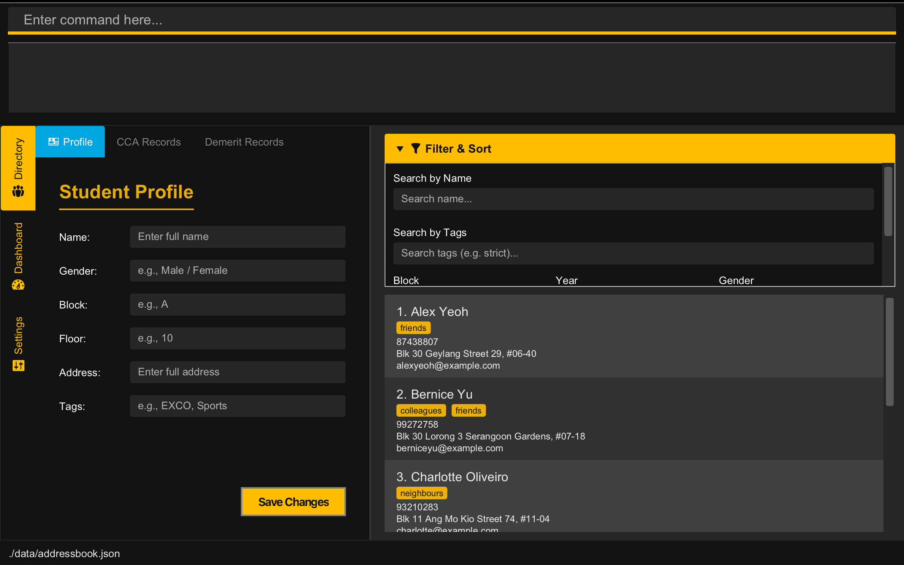
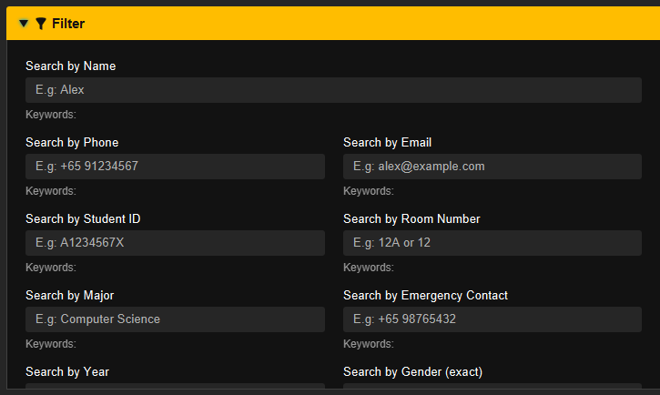
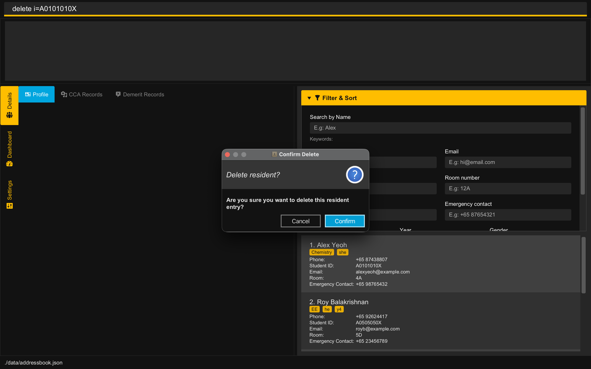
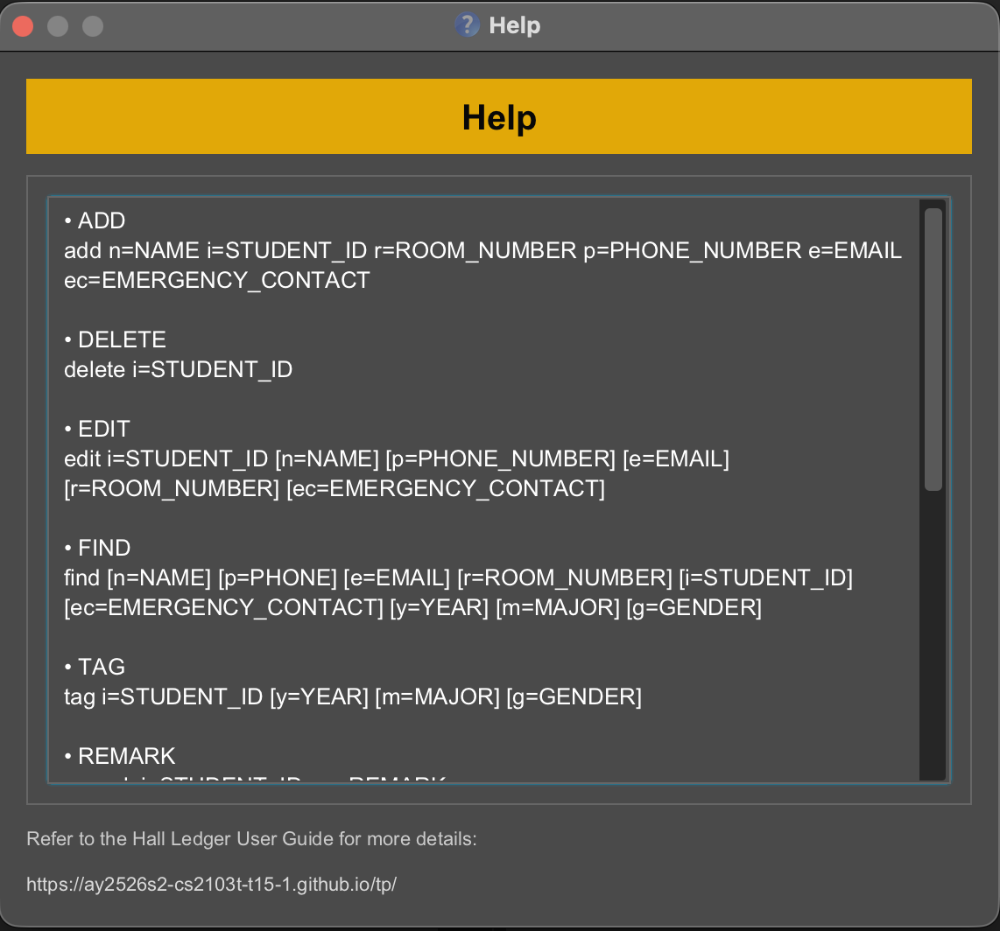

 ---
  layout: default.md
  title: "User Guide"
  pageNav: 3
 ---

# Hall Ledger User Guide

**Hall Ledger (HL)** is a desktop application that helps **Resident Assistants (RAs) efficiently manage residents in NUS halls**. It is optimised for users who prefer typing commands, while still offering an intuitive visual interface for viewing resident data at a glance.
<!-- * Table of Contents -->
---
## **Table of Contents**

1. [Quick Start](#quick-start)  
   1.1. [Installation Guide](installation-guide)  
   1.2. [Introduction to the Interface](introduction-to-the-interface)  
   1.3. [Brief Walkthrough](brief-walkthrough)  
2. [General Command Format](general-command-format)  
3. [Adding a Resident](#3-adding-a-resident)  
4. [Editing a Resident](#4-editing-a-resident)
5. [Tagging a Resident](#6-tagging-a-resident)  
5.1. [Adding or Editing Tags](#61-adding-or-editing-tags)  
5.2 [Clearing Tags](#62-clearing-tags)
6. [Viewing and Finding Residents](#6-viewing-and-finding-residents)  
6.1. [Viewing All Residents](#61-listing-all-residents)    
6.2. [Finding Residents](#62-finding-residents)      
   &nbsp; 6.2.1. [Using the Command Line](#621-using-typed-commands)  
   &nbsp;  6.2.2. [Using the User Interface](#622-using-the-filter-panel)
7. [Managing Resident Remarks](#7-managing-resident-remarks-)  
   7.1. [Adding or Editing a Remark](#71-adding-or-editing-a-remark)  
   7.2. [Clearing a Remark](#72-clearing-a-remark)  
8. [Adding a Demerit Record to a Resident](#8-adding-a-demerit-record-to-a-resident)  
   8.1. [Listing Demerit Rules](#81-listing-demerit-rules)  
   8.2. [Adding a Demerit Record](#82-adding-a-demerit-record)  
9. [Deleting a Resident](#9-deleting-a-resident)  
10. [Clearing All Residents](#10-clearing-all-entries)  
11. [Viewing Help](#11-viewing-help)  
12. [Exiting the Program](#12-exiting-the-program)  
13. [Saving the Data](#13-saving-the-data)  
14. [Editing the Data File](#14-editing-the-data-file)  
15. [Prefix Table](#15-prefix-table)  
16. [Format Errors](#16-format-errors)  
17. [FAQ](#17-faq)  
18. [Known Issues](#18-known-issues)  
19. [Command Summary](#command-summary)  

---

## Quick start

1. Ensure you have Java `17` or above installed in your Computer. 
   **Mac users:** Ensure you have the precise JDK version prescribed [here](https://se-education.org/guides/tutorials/javaInstallationMac.html).

1. Download the latest `.jar` file from [here](https://github.com/AY2526S2-CS2103T-T15-1/tp/releases).

1. Copy the file to the folder you want to use as the _home folder_ for your HallLedger.

1. Open a command terminal, `cd` into the folder you put the jar file in, and use the `java -jar hall-ledger.jar` command to run the application. 
   A GUI similar to the below should appear in a few seconds. Note how the app contains some sample data. 
   

1. Type the command in the command box and press Enter to execute it. e.g. typing **`help`** and pressing Enter will open the help window. 
   Some example commands you can try:

   * `list` : Lists all residents.

   * `add n=John Doe p=+6598765432 e=johnd@example.com i=A1234567X r=1A ec=+65 12345678` : Adds a resident named `John Doe` to HallLedger.

   * `demeritlist` : Shows the indexed demerit rules available in HallLedger.

   * `demerit i=A1234567X di=18 rm=Visitor during quiet hours` : Adds a demerit record to the resident with student ID `A1234567X`.

   * `delete i=A1234567X` : Deletes the resident with student ID `A1234567X`.

   * `clear` : Deletes all residents.

   * `exit` : Exits the app.

1. Refer to the [Features](#features) below for details of each command.

--------------------------------------------------------------------------------------------------------------------

## Features

<box type="info" seamless>

**Notes about the command format:** 

* Words in `UPPER_CASE` are the parameters to be supplied by the user. 
  e.g. in `add n=NAME`, `NAME` is a parameter which can be used as `add n=John Doe`.

* Items in square brackets are optional. 
  e.g `n=NAME [e=EMAIL]` can be used as `n=John Doe e=johnd@example.com` or as `n=John Doe`.

* Items with `…`​ after them can be used multiple times including zero times. 
  e.g. `[t=TAG]…​` can be used as ` ` (i.e. 0 times), `t=friend`, `t=friend t=family` etc.

* Parameters can be in any order. 
  e.g. if the command specifies `n=NAME p=PHONE_NUMBER`, `p=PHONE_NUMBER n=NAME` is also acceptable.

* Extraneous parameters for commands that do not take in parameters (such as `help`, `list`, `exit` and `clear`) will be ignored. 
  e.g. if the command specifies `help 123`, it will be interpreted as `help`.

* If you are using a PDF version of this document, be careful when copying and pasting commands that span multiple lines as space characters surrounding line-breaks may be omitted when copied over to the application.

</box>

### Adding a person: `add`

Adds a person to the hall ledger.

Format: `add n=NAME p=PHONE_NUMBER e=EMAIL i=STUDENT_ID r=ROOM_NUMBER ec=EMERGENCY_CONTACT`

Examples:
* `add n=John Doe p=+6598765432 e=johnd@example.com i=A101010X r=1A ec=+91 2345 9876`
* `add n=Betsy Crowe i=A202020Y e=betsycrowe@example.com p=+65 1234567 r=14L ec=+6512345678`

> ___NOTE___
> 
> A newly added person will not have any tags

***
### Editing a person : `edit`

Edits an existing resident in the _Hall Ledger_.

Format: `edit STUDENT_ID [n=NAME] [p=PHONE] [e=EMAIL] [r=ROOM_NUMBER] [ec=EMERGENCY_CONTACT]`

* Edits the resident with the specified STUDENT_ID. STUDENT_ID is used to uniquely identify each resident in the displayed resident's list. The STUDENT_ID must be a valid student ID e.g. `A1234567X`.
* At least one of the optional fields must be provided.
* Existing values will be updated to the input values.

Examples:
* `edit A1234567X p=91234567 e=johndoe@example.com` edits the phone number and email address of the resident with student ID `A1234567X` to be `91234567` and `johndoe@example.com` respectively.
* `edit A8765432Y n=Betsy Crower ec=98765432` edits the name and emergency contact of the resident with student ID `A8765432Y` to be `Betsy Crower` and `98765432` respectively.
***

### Tagging a resident: `tag`

Adds **Major**, **Year** and **Gender** tags to an existing resident.

Format: `tag i=STUDENT_ID [m=MAJOR] [y=YEAR] [g=GENDER]`

* Adds or edits tags for the resident uniquely identified by *STUDENT_ID*.
* *STUDENT_ID* must be in a valid format and exist in the Hall Ledger
* At least one of the optional tag fields (m=, y=, g=) must be provided.
* Existing tags are replaced **(not cumulative)**.
* Each resident can have **at most** **one** Year, **one** Major, and **one** Gender tag at any time.
* Re-tagging a resident will **overwrite** previously assigned tags with the new values provided.

Examples:
* `tag i=A0123456N y=Y3 m=Information Systems`: Assigns Year 3 and Information Systems as the student’s tags (any existing tags are replaced).
* `tag i=A0101010X g=Female`: Updates the resident’s Gender to Female and leaves other tags unchanged.

***
### 6. Viewing and Finding Residents

#### 6.1 Viewing all residents

Displays all residents the resident list panel on the right.

**Command:** `list`

#### 6.2 Finding residents

Hall Ledger allows you to search for residents by:
* **Name**
* **Phone Number**
* **Email**
* **Room Number**
* **Student ID**
* **Emergency Contact**
* **Year**
* **Major**
* **Gender**   

You can perform searches either through the **typed commands** or through the **filter panel**.

<box type="info" seamless>
**Tip**: You may use the `list` command to reset the resident list after performing a search with the `find` command or
after using the Filter panel. This will allow you to see all residents again.
</box>

#### 6.2.1 Using Typed Commands

**Command:** `find`

**Usage:** `find [n=NAME] [p=PHONE] [e=EMAIL] [r=ROOM_NUMBER] [i=STUDENT_ID] [ec=EMERGENCY_CONTACT] [y=YEAR] [m=MAJOR] [g=GENDER]`

**Example**
Suppose you want to find all residents named "Alex":

* Type in the command box: `find n=Alex`
* The resident list updates to show all residents whose names match "Alex"

**Example: Finding residents with different prefixes**
Suppose you want to find residents named "Alex" who are in Year 2. You can search for both criteria at once:

* Type in the command box: `find n=Alex y=Y2`
* The resident list updates to show only residents who match **both** the name "Alex" **and** Year 2

**Example: Finding residents using multiple keywords within the same criterion**
Suppose you want to find residents named "Alex" or "Bernice". You can search for multiple values within the same
criterion by repeating that field:

* Type in the command box: `find n=Alex n=Bernice`
* The resident list updates to show only residents whose name match either "Alex" **or** Bernice

#### 6.2.2 Using the Filter Panel

The Filter Panel supports the same sea behaviour as the typed `find` command.

**Steps:**

1. Open the Filter panel (if it is collapsed).

   

2. Click on a filter field (e.g., "Search by Name"), then type a keyword.

3. Press Enter to add the keyword. The resident list updates to show residents that match the keyword in that field.

   

4. Add more keywords if needed:
    * Add more keywords in the same field to include residents that match any of the keywords in that field.
    * Add keywords in other fields to limit results to residents that match the keywords in every field you used.

5. To remove a keyword, click the `x` next to it.

6. To clear the filter completely, remove all keywords from all fields or type 'list' in the command box.

<box type="warning" seamless>

Entering a command in the command box will reset the Filter panel.

</box>

<box type="info" seamless>

**Tips:**

* Matching ignores letter case, and keyword order does not matter.
* Using more than one filter field makes the results more specific.
* Using more keywords in one field helps you find residents matching any of those keywords.
* Hall Ledger supports fuzzy matching, so you can still find results even when you type a partial keyword or make a
  small typo. For more details, see [Fuzzy Matching Details](FuzzyMatching.md).

</box>

### 7. Managing Resident Remarks: 

Remarks are **optional short notes** that can be added to a resident’s profile.
They can be used to store important information about the resident that does not fit into the other fields, such as allergies, medical conditions, or other special notes. 
You can view remarks in the resident's profile tab.    

**Command:** `remark`

#### 7.1 Adding or Editing a Remark
 
**Usage:** `remark i=STUDENT_ID rm=REMARK`

- Adds or edits a remark for the resident uniquely identified by `STUDENT_ID`.
- If a remark **already exists** for the resident, it will be **overwritten** by the new remark.
- There is no character limit for remarks, but keeping them concise is recommended for readability.
<box type="warning" seamless>
Remarks can contain any content. However, avoid using special characters that may interfere with the command format (e.g., `=` or `i=`), as they may cause issues when editing or clearing remarks.
</box>

Example usages:
- `remark i=A1234567X rm=Allergic to peanuts`
- `remark i=A1121212X rm=Has asthma, needs inhaler nearby`      

#### 7.2 Clearing a Remark
 
**Usage:** `remark i=STUDENT_ID rm=`

- Providing an empty `rm=` field clears the existing remark for the specified resident.

Example usage:
- `remark i=A1121212X rm=`

***

### Listing demerit rules: `demeritlist`

Shows the indexed demerit rules available in HallLedger.

Format: `demeritlist`

* Displays the demerit rule catalogue together with the rule index and point tiers.
* Use the displayed rule index together with the `demerit` command when recording a resident’s demerit incident.

Example:
* `demeritlist`

### Adding a demerit record: `demerit`

Adds a demerit record to an existing resident.

Format: `demerit i=STUDENT_ID di=RULE_INDEX [rm=REMARK]`

* Applies the demerit rule identified by `RULE_INDEX` to the resident identified by `STUDENT_ID`.
* `STUDENT_ID` must refer to an existing resident in HallLedger.
* `RULE_INDEX` must match one of the indexed rules shown by `demeritlist`.
* If the same resident receives the same rule again, HallLedger automatically applies the next offence tier for that rule.
* `rm=` is optional and can be used to store a short context note for that incident.
* The resident’s displayed total demerit points will update after the command succeeds.

Examples:
* `demerit i=A1234567X di=18`
* `demerit i=A1234567X di=18 rm=Visitor during quiet hours`
* `demerit i=A0312075X di=28 rm=Common pantry left dirty`

<box type="info" seamless>

**Current scope note:** HallLedger records resident demerit incidents and their accumulated totals. It does not yet automatically enforce semester-based or lifetime housing sanctions.

</box>

*** 
### 9. Deleting a Resident

Deletes the resident identified by student ID from HallLedger.

Format: `delete i=STUDENT_ID`

Example:
* `delete i=A0312075X`

After a valid delete command is entered, HallLedger shows a confirmation dialog before the resident is actually removed.

* Click **Confirm** to proceed with the deletion.
* Click **Cancel** to stop the deletion. HallLedger will display the message `Deletion cancelled.` and no resident will be removed.

If the command format is invalid, HallLedger will show an error message instead of opening the confirmation dialog.

***
### 10. Clearing all Residents

Clears all residents from HallLedger all at once.

Command: `clear`

<box type="warning" seamless>

**Caution:**
This action **permanently deletes all resident data**. We recommend creating a backup of your data file before running this command. Once cleared, the **deletion cannot be undone**.
</box>

***

### 11. Viewing Help

Opens the HallLedger Help window, which displays the available commands and their usage formats.

Command: `help`

      

 
 

***

### 12. Exiting the program : `exit`

Exits the program.

Command: `exit`
***

### 13. Saving the Data

HallLedger automatically saves your data on your device whenever you make changes. There is no need to manually save your work.

When you exit the program and open it again later, all your data will still be available.
***
### 14. Editing the Data File

HallLedger data are saved automatically as a JSON file `[JAR file location]/data/addressbook.json`. Advanced users are welcome to update data directly by editing that data file.

***

### 15. Prefix Table

***

### 16. Format Errors

**Caution:**
If your changes to the data file make its format invalid, HallLedger will discard all data and start with an empty data file at the next run. Hence, it is recommended to take a backup of the file before editing it. 
Furthermore, certain edits can cause HallLedger to behave in unexpected ways (e.g., if a value entered is outside the acceptable range). Therefore, edit the data file only if you are confident that you can update it correctly.

For more details on editing the JSON file, please refer to our [Developer Guide](DeveloperGuide.md)

--------------------------------------------------------------------------------------------------------------------

### 17. FAQ

**Q**: How do I transfer my data to another Computer?  
**A**: Install the app on the other computer and overwrite the empty data file it creates with the file that contains the data of your previous HallLedger home folder.

**Q**: Can I edit the data file manually?  
**A**: Yes. HallLedger stores data locally in a human-editable text file. However, manual edits should be done carefully, because invalid edits may prevent HallLedger from loading the data correctly.

**Q**: How do I go back to seeing the list of all residents after running `find`?  
**A**: Run the `list` command to see the full list of residents again.

--------------------------------------------------------------------------------------------------------------------

### 18. Known issues

1. **When using multiple screens**, if you move the application to a secondary screen, and later switch to using only the primary screen, the GUI will open off-screen. The remedy is to delete the `preferences.json` file created by the application before running the application again.
2. **If you minimize the Help Window** and then run the `help` command (or use the `Help` menu, or the keyboard shortcut `F1`) again, the original Help Window will remain minimized, and no new Help Window will appear. The remedy is to manually restore the minimized Help Window.

--------------------------------------------------------------------------------------------------------------------

### 19. Command summary

Action     | Format, Examples
-----------|----------------------------------------------------------------------------------------------------------------------------------------------------------------------
**[Add](#adding-a-person-add)** | `add n=NAME p=PHONE_NUMBER e=EMAIL i=STUDENT_ID r=ROOM_NUMBER ec=EMERGENCY_CONTACT`   e.g., `add n=James Lee p=+65 98765432 e=james@example.com i=A1234567X r=15R ec=+65 98765432`
**[Clear](#clearing-all-entries--clear)** | `clear`
**[Delete](#deleting-a-resident--delete)** | `delete i=STUDENT_ID`  e.g., `delete i=A1234567X`
**[Edit](#editing-a-person--edit)** | `edit STUDENT_ID [n=NAME] [p=PHONE_NUMBER] [e=EMAIL] [r=ROOM_NUMBER] [ec=EMERGENCY_CONTACT]`  e.g., `edit A1234567X n=James Lee e=jameslee@example.com`
**[Tag](#tagging-a-student-tag)** | `tag i=STUDENT_ID [m=MAJOR] [y=YEAR] [g=GENDER]`  e.g., `tag i=A1234567X m=CS y=Y3`
**[Find](#locating-persons-find)** | `find [n=NAME] [p=PHONE] [e=EMAIL] [r=ROOM_NUMBER] [i=STUDENT_ID] [ec=EMERGENCY_CONTACT] [y=YEAR] [m=MAJOR] [g=GENDER]`  e.g., `find n=James y=Y1`
**[Remark](#adding-a-remark-remark)** | `remark i=STUDENT_ID rm=REMARK`  e.g., `remark i=A1234567X rm=Allergic to peanuts`
**[Demerit List](#listing-demerit-rules-demeritlist)** | `demeritlist`
**[Add Demerit](#adding-a-demerit-record-demerit)** | `demerit i=STUDENT_ID di=RULE_INDEX [rm=REMARK]`  e.g., `demerit i=A1234567X di=18 rm=Visitor during quiet hours`
**[List](#listing-all-persons-list)** | `list`
**[Help](#viewing-help--help)** | `help`
