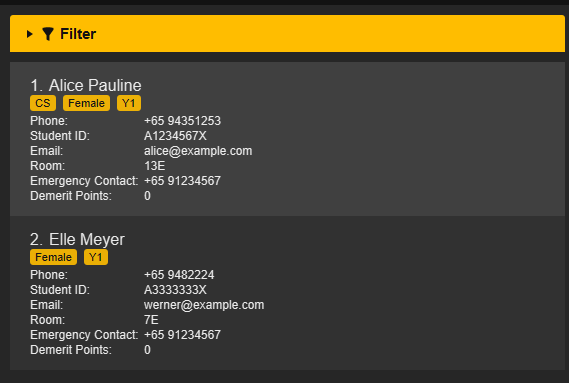
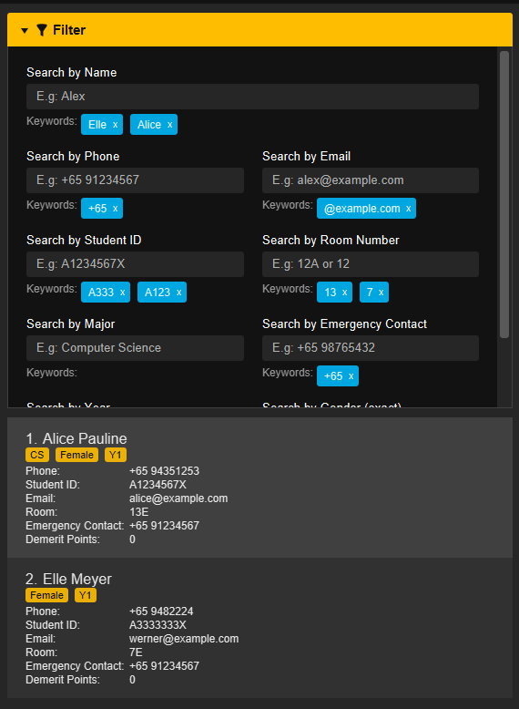

 ---
  layout: default.md
  title: "User Guide"
  pageNav: 3
 ---

# Hall Ledger User Guide

**Hall Ledger (HL)** is a desktop application that helps **Resident Assistants (RAs) efficiently manage residents in NUS halls**. It is optimised for users who prefer typing commands, while still offering an intuitive visual interface for viewing resident data at a glance.
<!-- * Table of Contents -->
---
## **Table of Contents**

1. [Quick Start](#quick-start)  
   1.1. [Installation Guide](installation-guide)  
   1.2. [Introduction to the Interface](introduction-to-the-interface)  
   1.3. [Brief Walkthrough](brief-walkthrough)  
2. [General Command Format](general-command-format)  
3. [Adding a Resident](#3-adding-a-resident)  
4. [Editing a Resident](#4-editing-a-resident)  
5. [Viewing and Finding Residents](#5-viewing-and-retrieving-data)  
   5.1. [Listing All Residents](#51-listing-all-residents)  
   5.2. [Finding Residents](#52-searching-residents)   
   &nbsp;&nbsp;&nbsp;&nbsp;5.2.1. [Using the Command Line](#521-using-the-command-line)   
   &nbsp;&nbsp;&nbsp;&nbsp;5.2.2. [Using the User Interface](#522-using-the-user-interface)  
6. [Tagging a Resident](#6-tagging-a-resident)  
   6.1. [Adding or Editing Tags](#61-adding-or-editing-tags)   
   6.2. [Clearing Tags](#62-clearing-tags)  
7. [Adding a Remark to a Resident](#7-adding-a-remark-remark)  
   7.1. [Adding or Editing a Remark](#71-adding-or-editing-a-remark)    
   7.2. [Clearing a Remark](#72-clearing-a-remark)  
8. [Adding a Demerit Record to a Resident](#8-adding-a-demerit-record-to-a-resident)  
   8.1. [Listing Demerit Rules](#81-listing-demerit-rules)  
   8.2. [Adding a Demerit Record](#82-adding-a-demerit-record)  
9. [Deleting a Resident](#9-deleting-a-resident)  
10. [Clearing All Residents](#10-clearing-all-entries)  
11. [Viewing Help](#11-viewing-help)  
12. [Exiting the Program](#12-exiting-the-program)  
13. [Saving the Data](#13-saving-the-data)  
14. [Editing the Data File](#14-editing-the-data-file)  
15. [Prefix Table](#15-prefix-table)  
16. [Format Errors](#16-format-errors)  
17. [FAQ](#17-faq)  
18. [Known Issues](#18-known-issues)  
19. [Command Summary](#command-summary)  

---

## Quick start

1. Ensure you have Java `17` or above installed in your Computer. 
   **Mac users:** Ensure you have the precise JDK version prescribed [here](https://se-education.org/guides/tutorials/javaInstallationMac.html).

1. Download the latest `.jar` file from [here](https://github.com/AY2526S2-CS2103T-T15-1/tp/releases).

1. Copy the file to the folder you want to use as the _home folder_ for your HallLedger.

1. Open a command terminal, `cd` into the folder you put the jar file in, and use the `java -jar hall-ledger.jar` command to run the application. 
   A GUI similar to the below should appear in a few seconds. Note how the app contains some sample data. 
   

1. Type the command in the command box and press Enter to execute it. e.g. typing **`help`** and pressing Enter will open the help window. 
   Some example commands you can try:

   * `list` : Lists all residents.

   * `add n=John Doe p=+6598765432 e=johnd@example.com i=A1234567X r=1A ec=+65 12345678` : Adds a resident named `John Doe` to HallLedger.

   * `demeritlist` : Shows the indexed demerit rules available in HallLedger.

   * `demerit i=A1234567X di=18 rm=Visitor during quiet hours` : Adds a demerit record to the resident with student ID `A1234567X`.

   * `delete i=A1234567X` : Deletes the resident with student ID `A1234567X`.

   * `clear` : Deletes all residents.

   * `exit` : Exits the app.

1. Refer to the [Features](#features) below for details of each command.

--------------------------------------------------------------------------------------------------------------------

## Features

<box type="info" seamless>

**Notes about the command format:** 

* Words in `UPPER_CASE` are the parameters to be supplied by the user. 
  e.g. in `add n=NAME`, `NAME` is a parameter which can be used as `add n=John Doe`.

* Items in square brackets are optional. 
  e.g `n=NAME [e=EMAIL]` can be used as `n=John Doe e=johnd@example.com` or as `n=John Doe`.

* Items with `…`​ after them can be used multiple times including zero times. 
  e.g. `[t=TAG]…​` can be used as ` ` (i.e. 0 times), `t=friend`, `t=friend t=family` etc.

* Parameters can be in any order. 
  e.g. if the command specifies `n=NAME p=PHONE_NUMBER`, `p=PHONE_NUMBER n=NAME` is also acceptable.

* Extraneous parameters for commands that do not take in parameters (such as `help`, `list`, `exit` and `clear`) will be ignored. 
  e.g. if the command specifies `help 123`, it will be interpreted as `help`.

* If you are using a PDF version of this document, be careful when copying and pasting commands that span multiple lines as space characters surrounding line-breaks may be omitted when copied over to the application.

</box>

### Viewing help : `help`

Opens the HallLedger Help window, which displays the available commands and their usage formats.

Format: `help`

Example:
* `help`

When the command is entered, HallLedger opens a Help window containing a quick reference list of supported commands. The Help window also includes a reference to the HallLedger User Guide for more detailed explanations.

### Adding a person: `add`

Adds a person to the hall ledger.

Format: `add n=NAME p=PHONE_NUMBER e=EMAIL i=STUDENT_ID r=ROOM_NUMBER ec=EMERGENCY_CONTACT`

Examples:
* `add n=John Doe p=+6598765432 e=johnd@example.com i=A101010X r=1A ec=+91 2345 9876`
* `add n=Betsy Crowe i=A202020Y e=betsycrowe@example.com p=+65 1234567 r=14L ec=+6512345678`

> ___NOTE___
> 
> A newly added person will not have any tags

### Listing all persons : `list`

Shows a list of all persons in the address book.

Format: `list`

### Tagging a resident: `tag`

Adds **Major**, **Year** and **Gender** tags to an existing resident.

Format: `tag i=STUDENT_ID [m=MAJOR] [y=YEAR] [g=GENDER]`

* Adds or edits tags for the resident uniquely identified by *STUDENT_ID*.
* *STUDENT_ID* must be in a valid format and exist in the Hall Ledger
* At least one of the optional tag fields (m=, y=, g=) must be provided.
* Existing tags are replaced **(not cumulative)**.
* Each resident can have **at most** **one** Year, **one** Major, and **one** Gender tag at any time.
* Re-tagging a resident will **overwrite** previously assigned tags with the new values provided.

Examples:
* `tag i=A0123456N y=Y3 m=Information Systems`: Assigns Year 3 and Information Systems as the student’s tags (any existing tags are replaced).
* `tag i=A0101010X g=Female`: Updates the resident’s Gender to Female and leaves other tags unchanged.

### Editing a person : `edit`

Edits an existing resident in the _Hall Ledger_.

Format: `edit STUDENT_ID [n=NAME] [p=PHONE] [e=EMAIL] [r=ROOM_NUMBER] [ec=EMERGENCY_CONTACT]`

* Edits the resident with the specified STUDENT_ID. STUDENT_ID is used to uniquely identify each resident in the displayed resident's list. The STUDENT_ID must be a valid student ID e.g. `A1234567X`.
* At least one of the optional fields must be provided.
* Existing values will be updated to the input values.

Examples:
* `edit A1234567X p=91234567 e=johndoe@example.com` edits the phone number and email address of the resident with student ID `A1234567X` to be `91234567` and `johndoe@example.com` respectively.
* `edit A8765432Y n=Betsy Crower ec=98765432` edits the name and emergency contact of the resident with student ID `A8765432Y` to be `Betsy Crower` and `98765432` respectively.

### Locating persons: `find`

Finds residents using one or more fields such as name, phone, email, room, student ID, emergency contact, year, major, and gender.

***Using the command line***

Format: `find [n=NAME] [p=PHONE] [e=EMAIL] [r=ROOM_NUMBER] [i=STUDENT_ID] [ec=EMERGENCY_CONTACT] [y=YEAR] [m=MAJOR] [g=GENDER]`

* Matching ignores letter case, and field order does not matter.
  * e.g. `find n=Alice y=Y1` gives the same result as `find y=Y1 n=ALICE`.
* If you use different fields together, a resident must satisfy all of them.
  * e.g. `find n=Alice p=9123 y=Y1` returns residents who match name, phone, and year.
* If you repeat the same field, matching any one of those values is enough.
  * e.g. `find y=Y2 y=Y3` returns residents in Year 2 or Year 3.
  * e.g. `find n=Hans Bo n=Anna Lee` returns residents matching either `n=` value.
* You can provide up to 10 values per field.
* `g=GENDER` uses full-value matching (case-insensitive). Other fields use fuzzy-friendly matching.

Examples:

* `find n=John Doe` returns residents whose names match `John Doe`.
* `find n=Alex n=David` returns residents matching either name value.
* `find m=CS m=Economics g=Male g=Others` returns residents whose major is `CS` or `Economics`, and whose gender is `Male` or `Others`.
* `find ec=+84 e=gmail` returns residents whose emergency contact matches `+84` and email matches `gmail`.

Result of running `find n=Alice Pauline` from the command line (matching resident(s) are shown in the list view):

***Using the user interface***

* Open the **Filter** panel to show the filter controls.
* Enter one or more keywords in any field, then press Enter to apply the filter.
* You can combine multiple keywords across multiple fields. The same matching behavior as the command-line `find`
  applies.
* To remove a keyword, click the `x` beside that keyword.

<box type="info" seamless>

For full matching behavior and examples, see [Fuzzy Matching Details](FuzzyMatching.md).

</box>

### 7. Adding a remark: `remark`

Remarks are **optional short notes** that can be added to a resident’s profile.
They can be used to store important information about the resident that does not fit into the other fields, such as allergies, medical conditions, or other special notes. 

**Command:** `remark`

#### 7.1 Adding or Editing a Remark
 
**Usage:** `remark i=STUDENT_ID rm=REMARK`

- If a remark already exists for the resident, it will be **overwritten** by the new remark.
- There is no character limit for remarks, but keeping them concise is recommended for readability.
- Remarks can contain any content. However, avoid using special characters that may interfere with the command format (e.g., `=` or `i=`), as they may cause issues when editing or clearing remarks.

Example usages:
- `remark i=A1234567X rm=Allergic to peanuts`
- `remark i=A1121212X rm=Has asthma, needs inhaler nearby`
---

#### 7.2 Clearing a Remark
 
**Usage:** `remark i=STUDENT_ID rm=`

- Providing an empty `rm=` field clears the existing remark for the specified resident.

Example usage:
- `remark i=A1121212X rm=`

### Listing demerit rules: `demeritlist`

Shows the indexed demerit rules available in HallLedger.

Format: `demeritlist`

* Displays the demerit rule catalogue together with the rule index and point tiers.
* Use the displayed rule index together with the `demerit` command when recording a resident’s demerit incident.

Example:
* `demeritlist`

### Adding a demerit record: `demerit`

Adds a demerit record to an existing resident.

Format: `demerit i=STUDENT_ID di=RULE_INDEX [rm=REMARK]`

* Applies the demerit rule identified by `RULE_INDEX` to the resident identified by `STUDENT_ID`.
* `STUDENT_ID` must refer to an existing resident in HallLedger.
* `RULE_INDEX` must match one of the indexed rules shown by `demeritlist`.
* If the same resident receives the same rule again, HallLedger automatically applies the next offence tier for that rule.
* `rm=` is optional and can be used to store a short context note for that incident.
* The resident’s displayed total demerit points will update after the command succeeds.

Examples:
* `demerit i=A1234567X di=18`
* `demerit i=A1234567X di=18 rm=Visitor during quiet hours`
* `demerit i=A0312075X di=28 rm=Common pantry left dirty`

<box type="info" seamless>

**Current scope note:** HallLedger records resident demerit incidents and their accumulated totals. It does not yet automatically enforce semester-based or lifetime housing sanctions.

</box>

### Deleting a resident : `delete`

Deletes the resident identified by student ID from HallLedger.

Format: `delete i=STUDENT_ID`

Example:
* `delete i=A0312075X`

After a valid delete command is entered, HallLedger shows a confirmation dialog before the resident is actually removed.

* Click **Confirm** to proceed with the deletion.
* Click **Cancel** to stop the deletion. HallLedger will display the message `Deletion cancelled.` and no resident will be removed.

If the command format is invalid, HallLedger will show an error message instead of opening the confirmation dialog.

### Clearing all residents : `clear`

Clears all residents from HallLedger all at once.

Command: `clear`

<box type="warning" seamless>

**Caution:**
This action **permanently deletes all resident data**. We recommend creating a backup of your data file before running this command. Once cleared, the **deletion cannot be undone**.

### Exiting the program : `exit`

Exits the program.

Command: `exit`

### Saving the data

HallLedger automatically saves your data on your device whenever you make changes. There is no need to manually save your work.

When you exit the program and open it again later, all your data will still be available.
### Editing the data file

HallLedger data are saved automatically as a JSON file `[JAR file location]/data/addressbook.json`. Advanced users are welcome to update data directly by editing that data file.

<box type="warning" seamless>

**Caution:**
If your changes to the data file make its format invalid, HallLedger will discard all data and start with an empty data file at the next run. Hence, it is recommended to take a backup of the file before editing it. 
Furthermore, certain edits can cause HallLedger to behave in unexpected ways (e.g., if a value entered is outside the acceptable range). Therefore, edit the data file only if you are confident that you can update it correctly.

</box>

For more details on editing the JSON file, please refer to our [Developer Guide](DeveloperGuide.md)

--------------------------------------------------------------------------------------------------------------------

## FAQ

**Q**: How do I transfer my data to another Computer?  
**A**: Install the app on the other computer and overwrite the empty data file it creates with the file that contains the data of your previous HallLedger home folder.

**Q**: Can I edit the data file manually?  
**A**: Yes. HallLedger stores data locally in a human-editable text file. However, manual edits should be done carefully, because invalid edits may prevent HallLedger from loading the data correctly.

**Q**: How do I go back to seeing the list of all residents after running `find`?  
**A**: Run the `list` command to see the full list of residents again.

--------------------------------------------------------------------------------------------------------------------

## Known issues

1. **When using multiple screens**, if you move the application to a secondary screen, and later switch to using only the primary screen, the GUI will open off-screen. The remedy is to delete the `preferences.json` file created by the application before running the application again.
2. **If you minimize the Help Window** and then run the `help` command (or use the `Help` menu, or the keyboard shortcut `F1`) again, the original Help Window will remain minimized, and no new Help Window will appear. The remedy is to manually restore the minimized Help Window.

--------------------------------------------------------------------------------------------------------------------

## Command summary

Action     | Format, Examples
-----------|----------------------------------------------------------------------------------------------------------------------------------------------------------------------
**[Add](#adding-a-person-add)** | `add n=NAME p=PHONE_NUMBER e=EMAIL i=STUDENT_ID r=ROOM_NUMBER ec=EMERGENCY_CONTACT`   e.g., `add n=James Lee p=+65 98765432 e=james@example.com i=A1234567X r=15R ec=+65 98765432`
**[Clear](#clearing-all-entries--clear)** | `clear`
**[Delete](#deleting-a-resident--delete)** | `delete i=STUDENT_ID`  e.g., `delete i=A1234567X`
**[Edit](#editing-a-person--edit)** | `edit STUDENT_ID [n=NAME] [p=PHONE_NUMBER] [e=EMAIL] [r=ROOM_NUMBER] [ec=EMERGENCY_CONTACT]`  e.g., `edit A1234567X n=James Lee e=jameslee@example.com`
**[Tag](#tagging-a-student-tag)** | `tag i=STUDENT_ID [m=MAJOR] [y=YEAR] [g=GENDER]`  e.g., `tag i=A1234567X m=CS y=Y3`
**[Find](#locating-persons-find)** | `find [n=NAME] [p=PHONE] [e=EMAIL] [r=ROOM_NUMBER] [i=STUDENT_ID] [ec=EMERGENCY_CONTACT] [y=YEAR] [m=MAJOR] [g=GENDER]`  e.g., `find n=James y=Y1`
**[Remark](#adding-a-remark-remark)** | `remark i=STUDENT_ID rm=REMARK`  e.g., `remark i=A1234567X rm=Allergic to peanuts`
**[Demerit List](#listing-demerit-rules-demeritlist)** | `demeritlist`
**[Add Demerit](#adding-a-demerit-record-demerit)** | `demerit i=STUDENT_ID di=RULE_INDEX [rm=REMARK]`  e.g., `demerit i=A1234567X di=18 rm=Visitor during quiet hours`
**[List](#listing-all-persons-list)** | `list`
**[Help](#viewing-help--help)** | `help`
